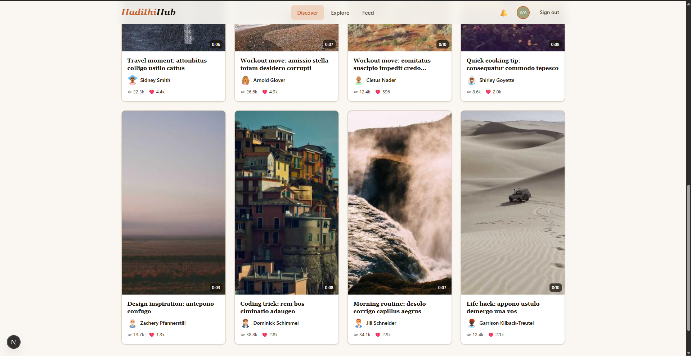

# HadithiHub A Full Stack Short-form Video App

**HadithiHub** is a full-stack short-form video platform where creators upload, showcase, and discover 10-second videos. It is built with a decoupled architecture designed for scalability.



---

## Table of Contents

- [ Features](#-features)
- [ Tech Stack](#-tech-stack)
- [ Getting Started](#-getting-started)
- [ Key Architectural Decisions](#-key-architectural-decisions)
- [ Rate Limits](#-rate-limits)
- [ License](#-license)

---

## Features

- Upload videos up to 10 seconds / 30MB (MP4, WebM, MOV)
- Client-side video compression with ffmpeg.wasm before upload
- Auth0 Universal Login with Google OAuth
- Follow system with personalised feed
- Like / unlike videos
- Nested comments (one level deep) with real-time updates
- Live typing indicators via Socket.io
- Notification system
- Video reporting / flagging
- Full admin panel — user suspension, content moderation, audit logs
- Platform analytics dashboard
- Seed script with 100 realistic users and videos via Faker.js
- End-to-end error monitoring with Sentry

---

## Tech Stack

| Layer                | Technology                                     |
| -------------------- | ---------------------------------------------- |
| **Frontend**         | Next.js 16, Vanilla CSS (custom design system) |
| **Backend**          | Node.js + Express (ES6 modules)                |
| **Database**         | MongoDB Atlas with Mongoose ODM                |
| **Authentication**   | Auth0 Universal Login, JWT, RBAC               |
| **Video Storage**    | Cloudinary (upload, CDN, thumbnails)           |
| **Real-time**        | Socket.io (comments, typing indicators)        |
| **Error Monitoring** | Sentry (frontend + backend)                    |

---

## Getting Started

### Prerequisites

- Node.js ≥ 18
- MongoDB Atlas account (free tier is sufficient)
- Auth0 account (free tier)
- Cloudinary account (for image uploads)

### Project Structure

```
hadithihub/
├── client/
└── server/
```

### Installation

### 1. **Clone the repository**

```bash
git clone https://github.com/kedwin26/hadithihub.git
cd hadithihub
```

### 2. Install dependencies

```bash
# Server
cd server && npm install

# Client
cd ../client && npm install

```

### 3. Set up environment variables

**Server** (`server/.env`):

```
PORT=5000
NODE_ENV=development
MONGODB_URI=mongodb+srv://...
AUTH0_DOMAIN=your-tenant.auth0.com
AUTH0_AUDIENCE=https://api.hadithihub.com
AUTH0_CLIENT_ID=your_client_id
AUTH0_CLIENT_SECRET=your_client_secret
CLOUDINARY_CLOUD_NAME=...
CLOUDINARY_API_KEY=...
CLOUDINARY_API_SECRET=...
CLIENT_ORIGIN=http://localhost:3000
SENTRY_DSN=...
```

**Client** (`client/.env.local`):

```
AUTH0_DOMAIN=your-tenant.auth0.com
AUTH0_CLIENT_ID=your_client_id
AUTH0_CLIENT_SECRET=your_client_secret
AUTH0_SECRET=<openssl rand -hex 32>
AUTH0_AUDIENCE=https://api.hadithihub.com
APP_BASE_URL=http://localhost:3000
NEXT_PUBLIC_API_URL=http://localhost:5000/api
NEXT_PUBLIC_SOCKET_URL=http://localhost:5000
NEXT_PUBLIC_AUTH0_DOMAIN=your-tenant.auth0.com
NEXT_PUBLIC_AUTH0_CLIENT_ID=your_client_id
NEXT_PUBLIC_AUTH0_AUDIENCE=https://api.hadithihub.com
NEXT_PUBLIC_CLOUDINARY_CLOUD_NAME=...
NEXT_PUBLIC_SENTRY_DSN=...
```

> **MongoDB Atlas tip:** Under _Network Access_, add `0.0.0.0/0` to allow connections from any IP (required for cloud deployment). For local development only, you can restrict to your own IP.

### 4. Seed the database

```bash
cd server
npm run seed
```

### 5. Run both services

```bash
# Terminal 1
cd server && npm run dev

# Terminal 2
cd client && npm run dev
```

Visit http://localhost:3000

---

## Key Architectural Decisions

| Decision                        | Rationale                                                                                                         |
| ------------------------------- | ----------------------------------------------------------------------------------------------------------------- |
| Auth0 Universal Login           | Zero-config Google OAuth, no custom token handling                                                                |
| Cloudinary CDN                  | Free tier video delivery, automatic transcoding, thumbnail generation                                             |
| ffmpeg.wasm dynamic import      | Loaded only on upload click — keeps initial page load fast                                                        |
| Mongoose upsert on login        | Local profile stays in sync with Auth0 identity on every request                                                  |
| Parent-child comments (1 level) | TikTok/Instagram UX pattern; compound index on `{videoId, parentId, createdAt}` keeps reply queries fast at scale |
| Debounced typing events         | Emits once per 3 seconds instead of every keystroke — prevents socket flooding                                    |
| useReducer for feed state       | Avoids cascading renders from multiple setState calls in effects                                                  |

---

## Rate Limits

| Endpoint group | Limit                   |
| -------------- | ----------------------- |
| Auth endpoints | 5 requests / min / IP   |
| Video upload   | 10 / hour / user        |
| Comments       | 30 / hour / user        |
| General API    | 100 requests / min / IP |

---

## License

This project is licensed under the [MIT License](./LICENSE).
